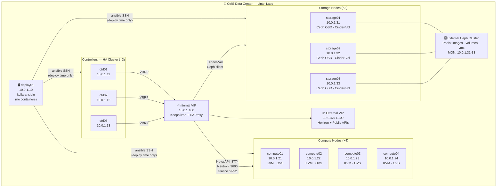
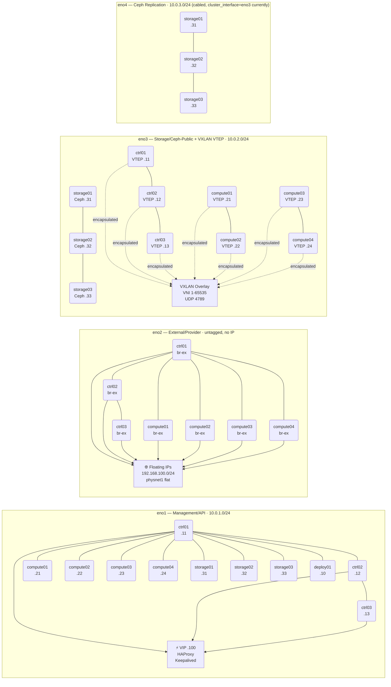
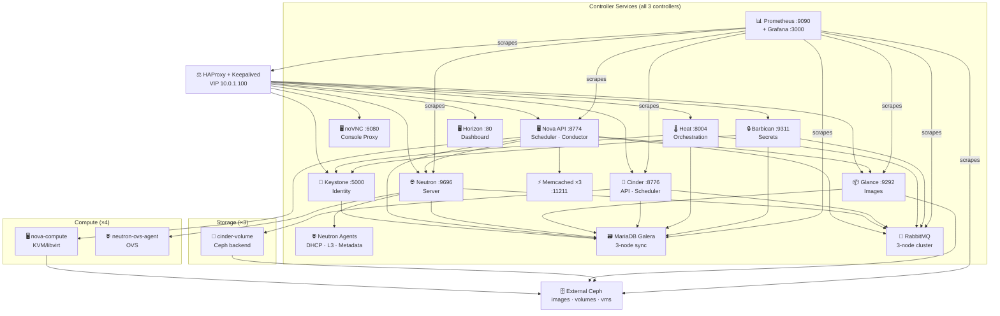
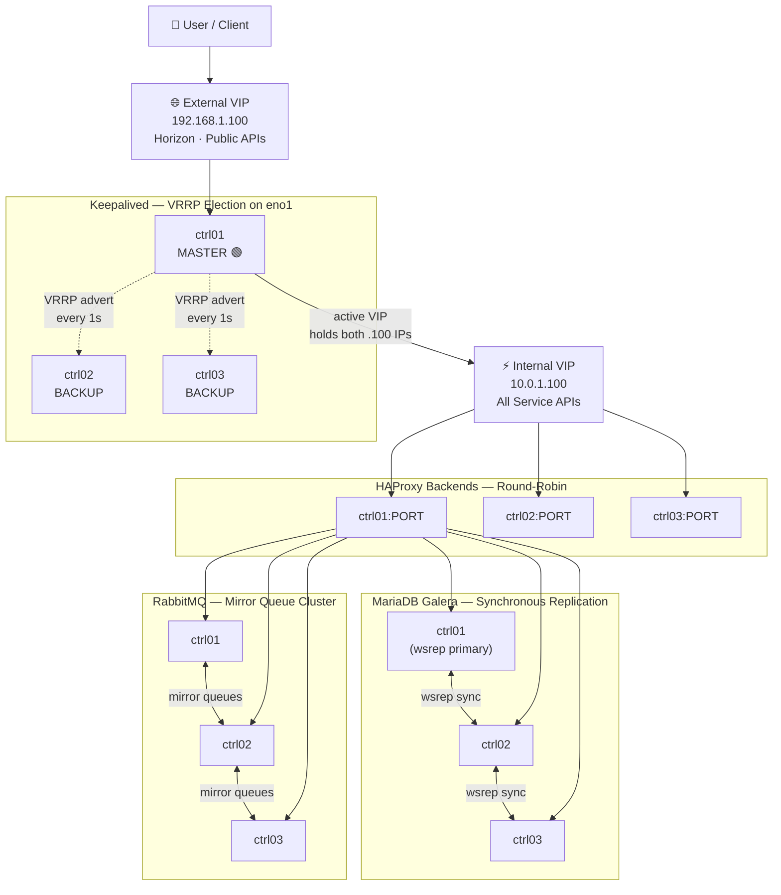
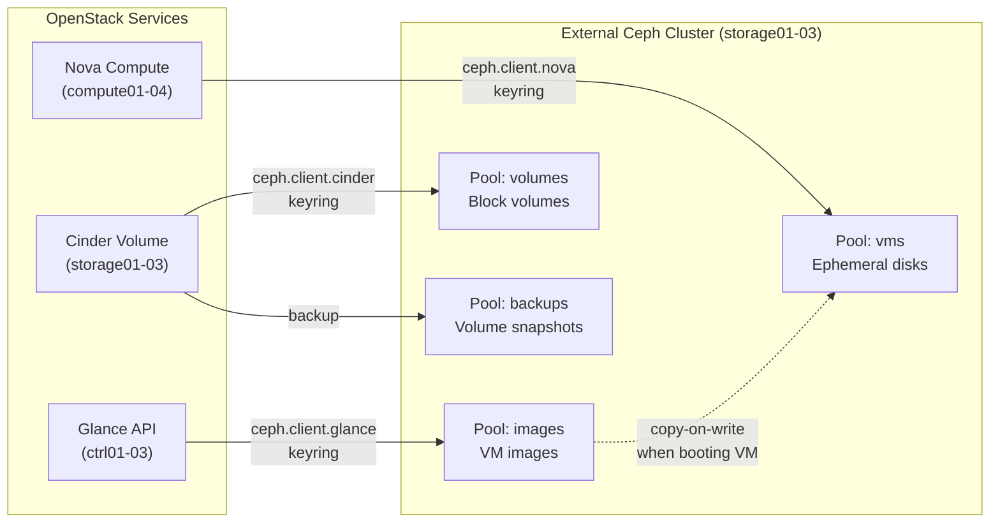

# Architecture Diagrams — Lintel Labs @ CtrlS Data Center

GitHub renders these Mermaid diagrams natively in the web UI.  
For an interactive visual version, open [topology.html](topology.html) in a browser.

---

## Diagram A — Node Topology

---

## Diagram B — Network Topology (4 Physical Networks)

---

## Diagram C — Service Dependency

---

## Diagram D — HA / Load Balancer Topology

---

## Diagram E — Storage Flow (Ceph Integration)

