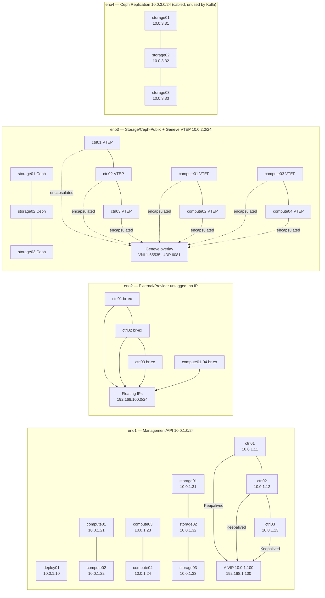

# Network Topology

---

## Physical Networks

Four physical networks are cabled. Each node has four NICs (eno1–eno4).

| Network | Interface | Subnet | Nodes | Purpose |
|---------|-----------|--------|-------|---------|
| **Management / API** | eno1 | 10.0.1.0/24 | All 10 nodes | SSH, Ansible, all OpenStack API traffic, Keepalived VRRP, HAProxy, Galera wsrep, RabbitMQ cluster, Memcached, noVNC |
| **External / Provider** | eno2 | *no IP (untagged)* | ctrl01-03, compute01-04 | Attached to OVN `br-ex` bridge. Carries VM floating IP traffic (north-south). No IP assigned to the host. |
| **Storage / Geneve VTEP** | eno3 | 10.0.2.0/24 | All 10 nodes | Ceph public network (client → OSD), live migration, Geneve tunnel endpoints (VTEPs) |
| **Ceph Replication** | eno4 | 10.0.3.0/24 | storage01-03 | Ceph OSD-to-OSD replication traffic *(wired but currently `cluster_interface = eno3` in globals.yml — see note below)* |

> ⚠️ **cluster_interface discrepancy:**  
> `globals.yml` has `cluster_interface: "eno3"` (same as `storage_interface`).  
> This means Ceph replication traffic currently shares the eno3 network with Ceph client I/O.  
> eno4/10.0.3.0/24 is cabled but unused by Kolla.  
> **To fix:** Change `cluster_interface: "eno4"` in globals.yml and run `kolla-ansible reconfigure`.

---

## IP Address Plan

### Controllers
| Node | eno1 (mgmt) | eno3 (storage) | VIP (eno1) |
|------|-------------|----------------|-----------|
| ctrl01 | 10.0.1.11 | 10.0.2.11 | 10.0.1.100 (internal, Keepalived) |
| ctrl02 | 10.0.1.12 | 10.0.2.12 | 192.168.1.100 (external, Keepalived) |
| ctrl03 | 10.0.1.13 | 10.0.2.13 | — |

### Compute Nodes
| Node | eno1 (mgmt) | eno3 (Geneve VTEP) |
|------|-------------|-------------------|
| compute01 | 10.0.1.21 | 10.0.2.21 |
| compute02 | 10.0.1.22 | 10.0.2.22 |
| compute03 | 10.0.1.23 | 10.0.2.23 |
| compute04 | 10.0.1.24 | 10.0.2.24 |

### Storage Nodes
| Node | eno1 (mgmt) | eno3 (Ceph public) | eno4 (Ceph replication) |
|------|-------------|---------------------|------------------------|
| storage01 | 10.0.1.31 | 10.0.2.31 | 10.0.3.31 |
| storage02 | 10.0.1.32 | 10.0.2.32 | 10.0.3.32 |
| storage03 | 10.0.1.33 | 10.0.2.33 | 10.0.3.33 |

---

## Geneve Overlay Network

Tenant VMs communicate over a Geneve overlay that runs on top of the eno3 physical network.  
OVN uses Geneve as its default tunnel protocol (replaces VXLAN used by legacy ML2/OVS).

| Parameter | Value |
|-----------|-------|
| Type driver | geneve |
| VNI range | 1 – 65535 |
| UDP port | 6081 |
| VTEP addresses | eno3 IP of each controller and compute node |
| L2/L3 | Handled natively by OVN (no separate DHCP/L3/metadata agents) |
| ARP responder | Built into OVN (Logical Switch Port ARP responses) |
| Default tenant type | geneve (set in `neutron_tenant_network_types`) |

**How it works:**
1. Tenant creates a network → OVN Northbound DB records the logical switch
2. `ovn_northd` translates to Southbound DB flows and distributes to all `ovn_controller` instances
3. When a VM starts on compute01 → `ovn_controller` programs OVS flow tables: VM port → Geneve tunnel → VTEP on eno3
4. Traffic is encapsulated in Geneve UDP and delivered directly to the destination compute node

---

## Provider / External Networks

| Parameter | Value |
|-----------|-------|
| Physical network name | physnet1 |
| OVN bridge | br-ex |
| Physical NIC | eno2 (attached to br-ex via OVN) |
| Supported type drivers | flat, vlan |
| VLAN range on physnet1 | 100–200 |
| Flat network | Yes (the external floating-IP network uses flat mode) |
| External subnet | 192.168.100.0/24 |
| External gateway | 192.168.100.1 |
| Floating IP pool | 192.168.100.100 – 192.168.100.200 |

**External network created by post-deploy.sh:**
```bash
openstack network create --external --provider-physical-network physnet1 \
  --provider-network-type flat public-net
openstack subnet create --network public-net \
  --subnet-range 192.168.100.0/24 --gateway 192.168.100.1 \
  --allocation-pool start=192.168.100.100,end=192.168.100.200 \
  --no-dhcp public-subnet
```

---

## Traffic Flows

### East-West (VM to VM, same tenant)
```
VM on compute01                      VM on compute04
  │                                        │
  └── OVN logical port → VNI 5001         └── OVN logical port → VNI 5001
        │                                        │
        └── Geneve encap (UDP 6081)              └── Geneve decap
              │                                        ▲
              └── eno3 (10.0.2.21) ──────────────────── eno3 (10.0.2.24)
```
Traffic never touches the controller. OVN distributes forwarding state to all `ovn_controller` instances.

### North-South (VM to Internet via floating IP)
```
VM (10.10.0.5, private)
  │
  └── OVN logical router on compute01 (distributed FIP — no controller hairpin)
          │
          ├── DNAT: floating IP 192.168.100.150 → 10.10.0.5 (handled locally on compute)
          └── br-ex → eno2 (untagged) → physical switch → Internet
```

### Live Migration (Nova compute to compute)
```
compute01 (source VM)                   compute02 (destination)
  │                                          │
  └── RAM pages → TCP stream ──────────────▶ └── RAM written to dest hypervisor
  
  VM disk: already in Ceph RBD pool "vms" — NO disk transfer needed
  Downtime: < 500ms (only the final dirty pages + CPU registers)
```

---

## Neutron OVN Topology

```
Controllers (ctrl01, ctrl02, ctrl03)        Compute (compute01-04)
┌─────────────────────────────────────┐    ┌─────────────────────────┐
│  neutron-server   (9696 on VIP)     │    │  ovn_controller         │
│  ovn_northd  (NB→SB translation)   │    │  neutron_ovn_           │
│  ovn_ovsdb_nb  (Northbound DB)      │    │  metadata_agent         │
│  ovn_ovsdb_sb  (Southbound DB)      │    │  openvswitch_db         │
│  openvswitch_db                     │    │  openvswitch_vswitchd   │
│  openvswitch_vswitchd               │    │                         │
│  br-int  br-ex                      │◄──►│  br-int  br-ex          │
│  (OVN chassis, gateway ports)       │    │  (tap ports, Geneve)    │
└─────────────────────────────────────┘    └─────────────────────────┘
```

No dedicated network nodes — controllers serve as OVN gateway chassis.  
L2/L3/DHCP handled natively by OVN (no separate dhcp-agent, l3-agent, or metadata-agent containers).  
(`[network]` group in inventory/multinode = 10.0.1.11, 10.0.1.12, 10.0.1.13)

---

## Network Diagram (Mermaid)


